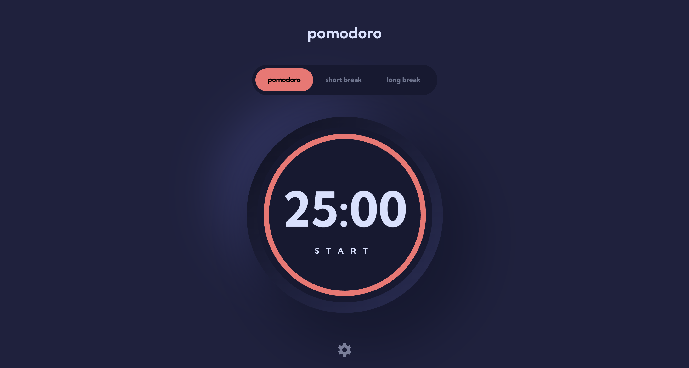

Pomodoro App is a dynamic web application built with React, designed to boost productivity using the Pomodoro Technique. It features customizable timers for work and break sessions, a theme toggle for light and dark modes, task management, and a responsive design optimized for mobile and desktop.

